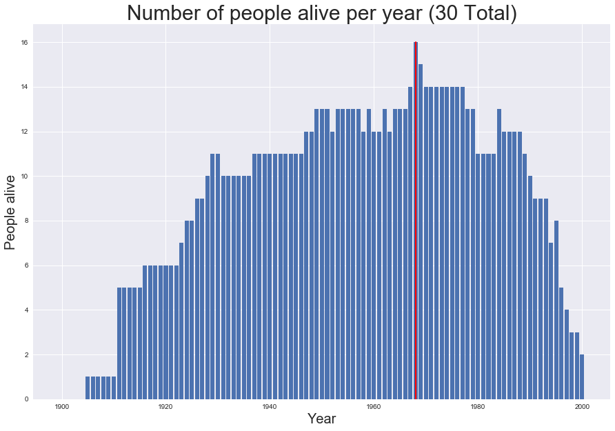
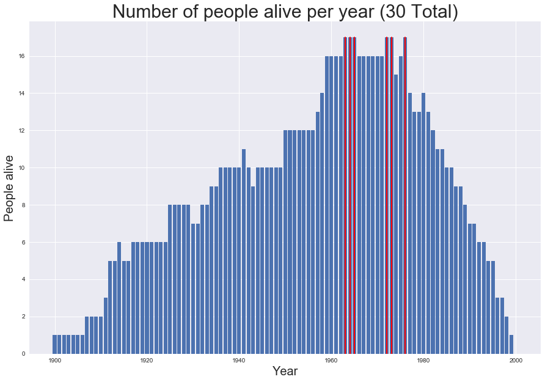
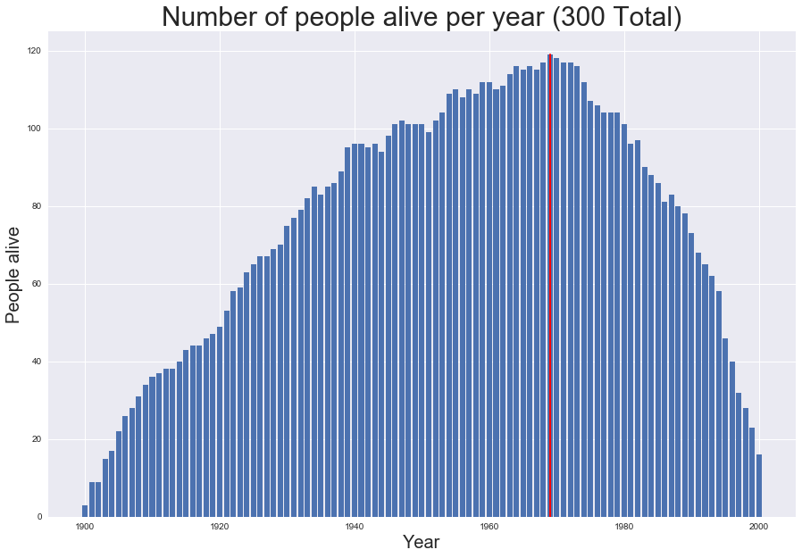
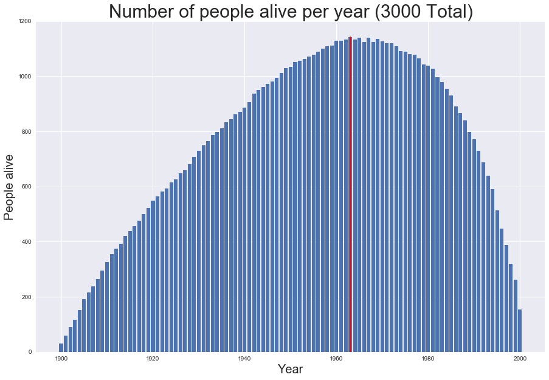
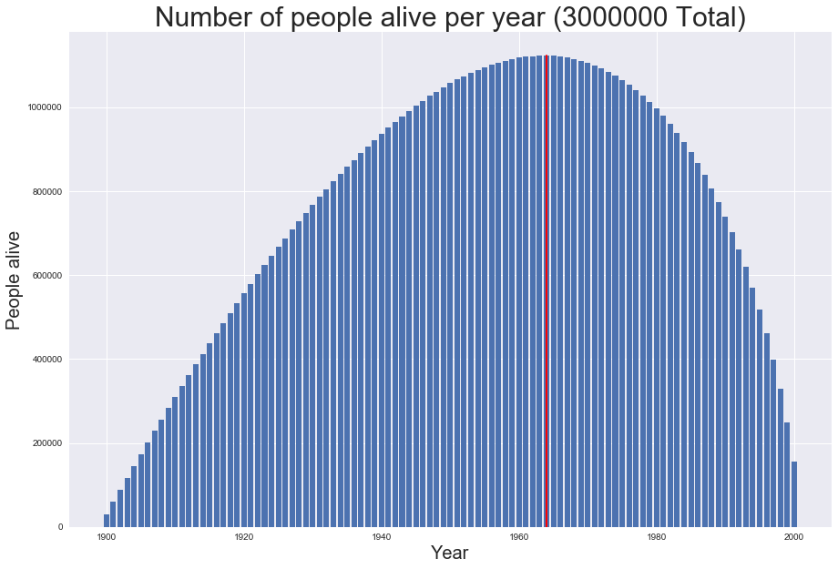

# This notebook demonstrates the code that solved the problem:

*Given a list of people with their birth and end years (all between 1900 and 2000), find the year with the most number of people alive.*

## Code

The function that solves the problem is located under **population/population.py**

It is called **max_population_year:**

```python
def max_population_year(people_list):
        '''Given a list of of people with their birth and death years from
        [1900, 2000], find the year(s) with most number of people alive

        Input Parameters
        ----------------
        people_list: list with each entry of the form [birth, death] for each person

        Output Parameters:
        ----------------
        max_year_list: list of years that had a population equal to the maximum
        population obtained in the period 1900, 2000

        year_list: list with length of 100 that contains the population per year

        >>> max_population_year([[1900,1902]])[0]
        [1900, 1901, 1902]

        >>> max_population_year([[1900,1950], [1925,1950], [1900,2000], [1930,1930]])[0]
        [1930]

        >>> max_population_year([[2000,2000]])[0]
        [2000]

        '''
        #create an array with 100 elements to represent each year between 1900-2000
        #setting its values to zero; index 0-->1900, 1-->1901,  ... , 100 --> 2000
        year_list = np.zeros(101)
        #loop over the list of people and get the birth and death years
        for person in people_list:
              birth, death = person
              #check to years to be between 1900-2000, send exceprion upstream
              if birth < 1900 or birth > 2000:
                  raise ValueError('Valid birth value must be between [1900, 2000]')
              if death < 1900 or death > 2000:
                  raise ValueError('Valid death value must be between [1900, 2000]')
              #map actual year to index in year_list
              birth = birth - 1900
              death = death - 1900
              #increment the values in the year_list for the years on which the current person was alive
              #beware of numpy's slice access from [initial-index, final-index)
              year_list[birth:death + 1] = year_list[birth:death + 1] + 1

        max_population = year_list.max()
        #find the year (or years) with the maximum count, these years are the years
        #with the most people alive
        max_year_list = np.where(year_list == max_population)[0]
        #convert indices to years
        max_year_list = max_year_list + 1900
        #return the lists
        return max_year_list.tolist(), year_list.tolist()


```

## Tests and Analysis

```python
#Import dependencies, including the functions writtend for the given task
#my module
from population import population
#python modules
import matplotlib.pyplot as plt
import numpy as np
import seaborn as sns

%matplotlib inline
sns.set()
```

### Generate a random sample of people with:
* 1900 <= birth year  <= 2000
* birth year <= death year <= 200


```python
#generate population sample using "generate_sample" I wrote at population/population.py
total = 30
people = population.generate_sample(total)
#list a few examples:
people[:5]
```


    [[1928, 1950], [1968, 1988], [1964, 1995], [1905, 1930], [1947, 2000]]


### Use our function to find the year(s) that had the highest number of people alive


```python
most_alive_years, population_per_year = population.max_population_year(people)
print(f'The year(s) with the most number of people alive is: {most_alive_years}')
```

    The year(s) with the most number of people alive is: [1968]


### Plot the population by year to confirm our result


```python
fig = plt.figure(figsize=(15,10))
ax = fig.add_subplot(1,1,1)
ax.set_title(f'Number of people alive per year ({total} Total)', fontsize=30)
ax.bar(1900 + np.arange(0,len(population_per_year)),population_per_year)
ax.set_xlabel('Year', size=20)
ax.set_ylabel('People alive', size=20)
for year in most_alive_years:
    ax.axvline(x=year, ymin=0.0,ymax =population_per_year[year - 1900]/plt.ylim()[1], linewidth=2, color='red')
```





### Analysis for different sample sizes


```python
def analyze(sample_size = 30):
    total = sample_size
    people = population.generate_sample(total)
    most_alive_years, population_per_year = population.max_population_year(people)
    print(f'The year(s) with the most number of people alive is: {most_alive_years}')
    fig = plt.figure(figsize=(15,10))
    ax = fig.add_subplot(1,1,1)
    ax.set_title(f'Number of people alive per year ({total} Total)', fontsize=30)
    ax.bar(1900 + np.arange(0,len(population_per_year)),population_per_year)
    ax.set_xlabel('Year', size=20)
    ax.set_ylabel('People alive', size=20)
    for year in most_alive_years:
        ax.axvline(x=year, ymin=0.0,ymax =population_per_year[year - 1900]/plt.ylim()[1], linewidth=2, color='red')
```


```python
analyze(30)
```

    The year(s) with the most number of people alive is: [1963, 1964, 1965, 1972, 1973, 1976]





```python
analyze(300)
```

    The year(s) with the most number of people alive is: [1969]





```python
analyze(3000)
```

    The year(s) with the most number of people alive is: [1963]





```python
analyze(3000000)
```

    The year(s) with the most number of people alive is: [1964]



